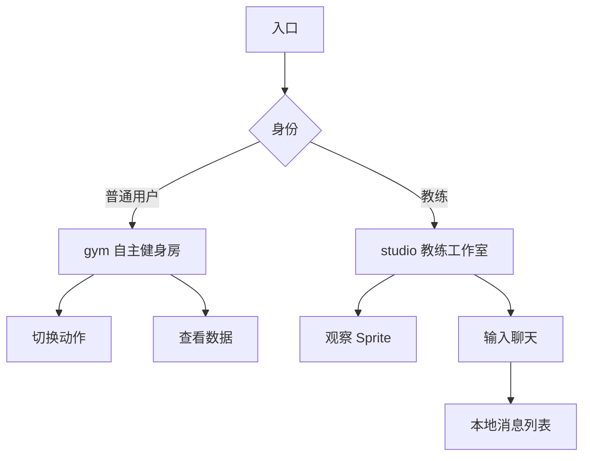

## 1. Product Overview
SecondMe Fitness 是一款基于 Web 的虚拟健身房应用，通过 2D 游戏化界面让用户在浏览器中体验沉浸式健身训练。产品面向希望通过游戏化方式提升健身趣味性的个人用户，解决传统健身枯燥、缺乏互动的问题。

目标市场：居家健身人群、游戏化健身爱好者、初级健身用户。

## 2. Core Features

### 2.1 User Roles
| Role | Registration Method | Core Permissions |
|------|---------------------|------------------|
| 普通用户 | 邮箱注册 | 进入 /gym 自主训练、查看个人状态 |
| 教练用户 | 邀请码升级 | 进入 /studio 指导训练、与用户实时聊天 |

### 2.2 Feature Module
核心页面仅保留两个，提升单页内容丰富度：
1. **教练工作室（/studio）**：左侧 2D 健身房场景 + Sprite 角色，右侧聊天与状态面板。
2. **自主健身房（/gym）**：全屏 2D 场景，用户可自由切换训练动作并查看实时数据。

### 2.3 Page Details
| Page Name | Module Name | Feature description |
|-----------|-------------|---------------------|
| 教练工作室 | 2D 游戏画面 | 渲染健身房背景，Canvas 或绝对定位；接收 x,y 坐标与 actionType，动态切换 idle/squat/push_up 精灵图或占位色块 |
| 教练工作室 | 聊天对话框 | 展示历史消息气泡（用户/教练区分）、底部输入框与发送按钮，静态数据，不连 API |
| 教练工作室 | 状态面板 | 显示当前用户身高、体重、BMI，实时更新 |
| 自主健身房 | 2D 主场景 | 全屏健身房背景，用户 Sprite 居中，支持键盘/按钮切换动作 |
| 自主健身房 | 实时数据 | 显示当前动作、持续时长、消耗卡路里估算 |

## 3. Core Process
普通用户流程：
打开应用 → 进入 /gym → 观察角色 → 点击动作按钮切换 squat/push_up → 查看实时数据 → 结束训练。

教练用户流程：
登录 → 进入 /studio → 左侧观察用户 Sprite 动作 → 右侧输入指导消息 → 发送后消息立即出现在对话列表 → 查看用户状态面板调整训练建议。

## 4. User Interface Design
### 4.1 Design Style
- 主色：活力橙 #FF6A00，辅色：深空灰 #1E1E1E，点缀绿 #00C48C。
- 按钮：圆角 8 px，3D 微阴影，hover 轻微放大。
- 字体：Inter，标题 24 px，正文 14 px，数字等宽 16 px。
- 布局：左右分栏采用 CSS Grid，2D 场景区域无边框，聊天面板卡片化带 12 px 圆角。
- 图标：使用开源 HeroIcons，线性风格，大小 20 px。

### 4.2 Page Design Overview
| Page Name | Module Name | UI Elements |
|-------------|---------------|---------------|
| 教练工作室 | 2D 游戏画面 | 宽 60%，高 100%，背景图覆盖全区域；Sprite 色块 64×64 px，不同动作映射不同渐变色；帧率 30 FPS 平滑移动 |
| 教练工作室 | 聊天对话框 | 宽 40%，右侧列；消息气泡最大宽 70%，用户右对齐蓝渐变，教练左对齐橙渐变；输入框贴底，高 48 px，发送按钮橙底白字 |
| 教练工作室 | 状态面板 | 卡片白底，内边距 16 px；身高、体重、BMI 三行，大数字 32 px 粗体，单位 12 px 灰色；底部小图表示趋势 |
| 自主健身房 | 2D 主场景 | 全屏背景，顶部 56 px 透明标题栏；中央 Sprite 128×128 px，动作切换按钮悬浮于右下角，圆形 56 px，图标居中 |
| 自主健身房 | 实时数据 | 顶部右侧半透明卡片，白底 90% 不透明度；显示当前动作中文名、持续秒数、卡路里，数字绿色高亮 |

### 4.3 Responsiveness
桌面优先：最小宽 1024 px，低于该宽度提示使用大屏设备；暂不单独适配移动端，保持鼠标交互为主。

### 4.4 3D Scene Guidance
不适用，本项目采用 2D Canvas/CSS 绝对定位方案。